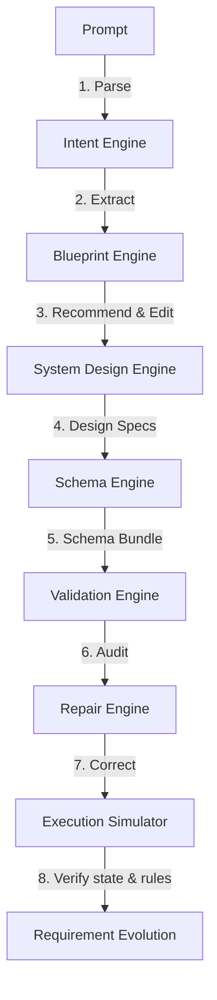

# GenesisAI - Self-Healing Software Compiler

GenesisAI is a software compiler that translates natural language prompts into verified, self-healed, and executable application architectures. 

It manages the software engineering lifecycle logically: decomposing intent, recommending design patterns, generating database and REST API schemas, validating constraints, self-healing compilation errors, and propagating change requirements transactionally.

---

## 1. Problem Statement

Traditional AI code generators emit template boilerplates or disconnected files. When templates drift, the code breaks. They cannot analyze or repair their own design defects. 

Furthermore, introducing a single change requirement often triggers cascades of broken database tables, invalid API routes, and authorization mismatches. Developers are forced to either rewrite massive portions of code or fully rebuild applications.

---

## 2. The GenesisAI Solution

GenesisAI shifts the focus from raw code emission to **logical specification compilation**. 

It converts prompts into strongly typed AST specifications, validates database normalizations, REST endpoints, and permissions, automatically repairs design violations, runs in-memory execution simulation tests, and performs surgical requirements updates with rollback safety.

### Why GenesisAI?
- **Self-Healing Compiler**: Detects design flaws and applies rule-based repair strategies automatically without human intervention.
- **In-Memory Verification**: Proves that compiled architectures are executable and secure before generating code.
- **Surgical Requirement Evolution**: Updates only the components affected by new requirements (e.g. adding subscriptions), keeping other layers untouched.
- **Transactional Checkpoints**: Saves snapshots of schemas. If a requirements update fails post-validation or simulation, the compiler rolls back to the previous stable state.

---

## 3. Compiler Pipeline Flow



1. **Intent Extraction**: Deconstructs prompt details to identify actors, features, rules, and constraints.
2. **Blueprint Recommendation**: Suggests ranked best practices (industry patterns) and community innovations.
3. **Specification Compilation**: Maps entities, fields, relationships, workflows, and permissions into a logical AST specification.
4. **Schema Generation**: Compiles the AST into Database Tables, REST APIs, UI Views, and Auth schemas.
5. **Validation Engine**: Performs cross-layer consistency and structural checks (14 validators).
6. **Repair Engine**: Resolves compilation errors surgically using a libraries catalog of 13+ repair strategies.
7. **Execution Simulation**: Steps through workflows in-memory checking virtual auth access, database tables, and business rules.
8. **Requirement Evolution**: Propagates change requests incrementally, tracking version timelines and rollback snapshots.

---

## 4. API Documentation

GenesisAI exposes a developer portal backend via FastAPI on `http://127.0.0.1:8000`:

### Endpoints Overview

| Method | Route | Description |
| :--- | :--- | :--- |
| **POST** | `/compile` | Compile prompt into project specification and schemas. |
| **POST** | `/demo/compile` | Compile and auto-evolve a preconfigured demo prompt. |
| **POST** | `/validate` | Run validation tests on a project. |
| **POST** | `/repair` | Repair validation errors found in a project. |
| **POST** | `/simulate` | Simulate workflow steps in-memory. |
| **GET** | `/dashboard` | Retrieve global statistics and compile latency averages. |
| **GET** | `/architecture/{project_id}` | Retrieve graph layout nodes, edges, and relationships. |
| **GET** | `/versions/{project_id}` | Retrieve version lists and requirement evolution timelines. |
| **GET** | `/project/{project_id}` | Retrieve full compiled application JSON dump. |

---

## 5. Local Quickstart

### 1. Install dependencies:
```bash
pip install -r requirements.txt
```

### 2. Initialize and Seed SQLite database:
```bash
python -c "from database.connection import init_db; init_db()"
```

### 3. Start ASGI server:
```bash
uvicorn core.api:app --host 127.0.0.1 --port 8000 --reload
```
Open your browser at `http://127.0.0.1:8000/docs` to explore the interactive Swagger documentation.

---

## 6. Screenshots Placeholder

*Visual screenshot mockups of the GenesisAI Developer Portal dashboard screens go here:*

#### Dashboard Screen
`[Insert SS_001 here - Shows project count, validation pass rates, and latencies]`

#### Architecture Map Canvas
`[Insert SS_004 here - Shows tables, endpoints, and workflow graph nodes]`

#### Evolution Version Timeline
`[Insert SS_006 here - Shows version v1.0 and v1.1 side-by-side with risk scores]`

---

## 7. Future Scope

1. **Physical Code Generators**: Add code generators to emit executable Python FastAPI microservices and React TypeScript frontends.
2. **Database Migration Scripts**: Emit SQL DDL migration files (e.g. `ALTER TABLE` operations) matching requirement change deltas.
