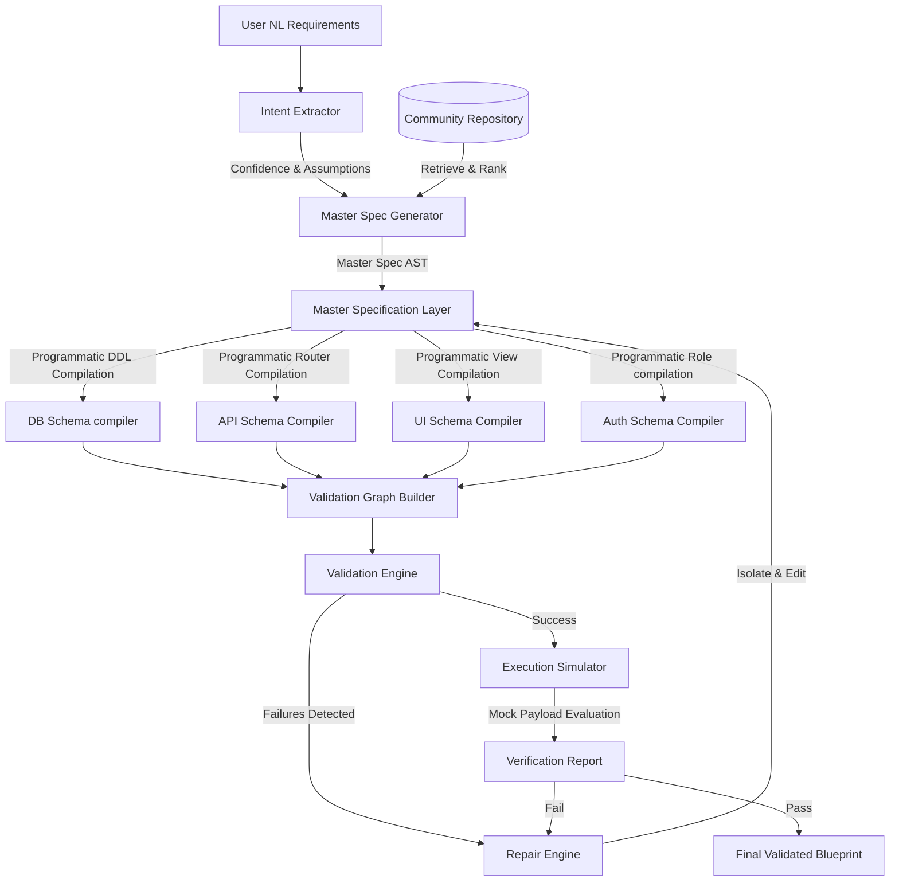

# AI Software Compiler: System Architecture & Implementation Plan

This document outlines the architecture, data models, prompt designs, validation algorithms, and implementation roadmap for the AI Software Compiler.

---

## 1. Architecture Review (Skeptical Principal Engineer Mode)

As a principal architect, I have scrutinized the proposed pipeline. Here are the core vulnerabilities, failure modes, and structural risks:

### Weakness 1: Generative Drift and Non-Determinism
*   **The Risk**: If the DB Schema, API Schema, UI Schema, and Auth Schema are generated by independent LLM calls (or even a single unconstrained call), they will inevitably drift. For instance, the DB schema might name a field `member_id`, while the API schema uses `user_id` and the UI refers to `client_id`. This breaks compilation immediately.
*   **Verdict**: Traditional prompt-to-JSON is insufficient. We must enforce a **Single Master Specification (AST)** from which all downstream schemas are programmatically compiled (or generated via strictly constrained schema-guided compilation).

### Weakness 2: Naive Retrieval & Feature Leakage in Community Repository
*   **The Risk**: Using a simple vector search to fetch "similar features" from previous projects will cause leakage of irrelevant components. For example, a gym application search might retrieve a "insulin dose tracker" from a medical app because the query mentioned "tracking".
*   **Verdict**: Retrieval must use a hybrid strategy: a strict **Category Match Filter** combined with semantic similarity and a weighted ranking algorithm.

### Weakness 3: Repair Engine Cascades (Regressions)
*   **The Risk**: If an error is detected in the database schema and we ask the LLM to fix the DB schema, it may change field names that break the API. If we re-generate the entire spec, we introduce new hallucinations.
*   **Verdict**: We need a **Topological Repair Scope**. The Repair Engine must isolate the failing node in the dependency graph, trace its downstream dependents, and patch *only* the affected schemas in topological order, locking the unchanged components.

### Weakness 4: Execution Simulation Hallucination
*   **The Risk**: If "Execution Simulation" is just an LLM prompt asking: *"Can the user book a class? Response: Yes/No"*, the LLM will hallucinate success.
*   **Verdict**: The simulator must execute against an abstract state machine (mock DB state) using a python-based transition runner. It must physically execute mock payloads against generated Pydantic inputs and track state transitions.

---

## 2. Improved Architecture

To address these vulnerabilities, the system will use a **Compiler AST Approach**:

```
                              +-------------------------+
                              |    Natural Language     |
                              |      Requirements       |
                              +------------+------------+
                                           |
                                           v
                              +------------+------------+
                              |    Intent Extractor     |
                              +------------+------------+
                                           |
                                           v
                              +------------+------------+
                              |      Master Spec        |
                              |    Generation (AST)     |
                              +------------+------------+
                                           |
                                           |
      +---------------------+--------------+--------------+---------------------+
      |                     |                             |                     |
      v                     v                             v                     v
+-----+-----+         +-----+-----+                 +-----+-----+         +-----+-----+
| Database  |         |    API    |                 |    UI     |         |   Auth    |
| Generator |         | Generator |                 | Generator |         | Generator |
+-----+-----+         +-----+-----+                 +-----+-----+         +-----+-----+
      |                     |                             |                     |
      +---------------------+--------------+--------------+---------------------+
                                           |
                                           v
                              +------------+------------+
                              |    Validation Graph     |
                              |   & Validation Engine   |
                              +------------+------------+
                                     /           \
                                    /             \
                             (Pass) /             \ (Fail)
                                   /               \
                                  v                 v
                       +----------+---------+  +----+----+
                       | Execution Simulator|  | Repair  |
                       +----------+---------+  | Engine  |
                                  |            +----+----+
                                  v                 |
                       +----------+---------+       |
                       |  Final Validated   |<------+
                       |     Blueprint      |
                       +--------------------+
```

### Core Design Rules:
1.  **Canonical Naming Engine**: A deterministic utility that sanitizes and maps all user inputs to `snake_case` (for fields/variables), `PascalCase` (for entities/classes), and standard REST URL formats.
2.  **Topological Dependency Graph**: Everything is parsed into a graph of nodes (Entities, Endpoints, Views, Rules). Any change or repair is propagated along the directed edges of this graph.

---

## 3. Component Diagram



---

## 4. Folder Structure

```
ai_software_compiler/
│
├── config.py                  # Environment config and LLM API setup
├── main.py                    # FastAPI entrypoint
│
├── core/
│   ├── ast.py                 # Master Specification Pydantic Models
│   ├── compiler.py            # Code-based Downstream Schema generators
│   └── naming.py              # Canonical Naming Engine
│
├── database/
│   ├── connection.py          # SQLite database connection setup
│   └── tables.py              # DB schemas for internal storage (Projects, Evaluation, Community)
│
├── stages/
│   ├── stage1_intent.py       # Intent Extraction & Confidence Scoring
│   ├── stage2_recommend.py    # Blueprint Recommendation Engine
│   ├── stage3_community.py    # Community Innovation Retrieval & Ranking
│   ├── stage4_explain.py      # Feature Explainability Layer
│   ├── stage5_system.py       # System Logical Design
│   └── stage6_schema.py       # Single-source schema orchestration
│
├── validation/
│   ├── engine.py              # Validation Engine (10 validation layers)
│   ├── graph.py               # Dependency Graph Builder (networkx)
│   └── rules.py               # Individual validation rules
│
├── repair/
│   └── engine.py              # Isolated repair orchestration
│
├── simulator/
│   └── runner.py              # Execution Simulator and state transition runner
│
├── change_engine/
│   └── engine.py              # Impact Analysis & Delta updates
│
├── evaluation/
│   ├── framework.py           # Testing framework for 10 normal + 10 edge cases
│   └── dataset.py             # Predefined validation inputs
│
├── ui/
│   └── app.py                 # Streamlit dashboard
│
└── tests/
    └── test_compiler.py       # Pytest suite
```

---

## 5. Database Design (SQLite)

We will use SQLite to manage project state, community innovations, and evaluation metrics.

```sql
-- Project blue prints and history
CREATE TABLE projects (
    id TEXT PRIMARY KEY,
    name TEXT NOT NULL,
    description TEXT,
    created_at TIMESTAMP DEFAULT CURRENT_TIMESTAMP
);

CREATE TABLE revisions (
    id TEXT PRIMARY KEY,
    project_id TEXT NOT NULL,
    version INTEGER NOT NULL,
    master_spec TEXT NOT NULL, -- JSON string of MasterSpecification AST
    confidence_score REAL NOT NULL,
    status TEXT NOT NULL, -- 'draft', 'validating', 'repaired', 'validated'
    created_at TIMESTAMP DEFAULT CURRENT_TIMESTAMP,
    FOREIGN KEY (project_id) REFERENCES projects(id)
);

-- Community Innovations Repository
CREATE TABLE innovations (
    id TEXT PRIMARY KEY,
    name TEXT NOT NULL UNIQUE,
    description TEXT NOT NULL,
    category TEXT NOT NULL,
    approval_count INTEGER DEFAULT 0,
    rejection_count INTEGER DEFAULT 0,
    acceptance_rate REAL DEFAULT 0.0,
    business_impact TEXT NOT NULL,
    created_at TIMESTAMP DEFAULT CURRENT_TIMESTAMP
);

-- Evaluation metrics store
CREATE TABLE eval_runs (
    id TEXT PRIMARY KEY,
    run_timestamp TIMESTAMP DEFAULT CURRENT_TIMESTAMP,
    mode TEXT NOT NULL, -- 'FAST', 'BALANCED', 'HIGH_QUALITY'
    success_rate REAL NOT NULL,
    average_latency REAL NOT NULL,
    total_cost REAL NOT NULL
);

CREATE TABLE eval_results (
    id TEXT PRIMARY KEY,
    run_id TEXT NOT NULL,
    prompt_id TEXT NOT NULL,
    prompt_type TEXT NOT NULL, -- 'normal', 'edge_case'
    success BOOLEAN NOT NULL,
    latency REAL NOT NULL,
    cost REAL NOT NULL,
    validation_errors TEXT, -- JSON array of strings
    repair_count INTEGER DEFAULT 0,
    FOREIGN KEY (run_id) REFERENCES eval_runs(id)
);
```

---

## 6. Data Models & 7. Pydantic Schemas

Here are the target schemas representing our **Master Specification AST** and the outputs of the Validation and Repair Engines.

```python
from pydantic import BaseModel, Field, validator
from typing import List, Dict, Any, Optional

# --- STAGE 1: INTENT & SPECIFICATION ---

class Actor(BaseModel):
    name: str = Field(..., description="Unique name of the actor/role (e.g. Admin, Member)")
    description: str = Field(..., description="Role and responsibilities of this actor")
    permissions: List[str] = Field(default_factory=list, description="List of logical actions permitted")

class EntityField(BaseModel):
    name: str = Field(..., description="Field name in snake_case")
    type: str = Field(..., description="Data type: string, integer, float, boolean, datetime, relationship")
    required: bool = True
    is_key: bool = False
    references: Optional[str] = Field(None, description="Format: EntityName.field_name for foreign keys")

class Entity(BaseModel):
    name: str = Field(..., description="Entity name in PascalCase")
    description: str = Field(..., description="Description of the business concept")
    fields: List[EntityField]
    constraints: List[str] = Field(default_factory=list, description="Unique, non-null or value range rules")

class APIEndpoint(BaseModel):
    path: str = Field(..., description="API Path (e.g. /bookings)")
    method: str = Field(..., description="GET, POST, PUT, DELETE")
    request_body_entity: Optional[str] = Field(None, description="PascalCase Entity name representing request body")
    response_body_entity: Optional[str] = Field(None, description="PascalCase Entity name representing response")
    roles_allowed: List[str] = Field(..., description="Actors permitted to use this route")
    description: str

class UIView(BaseModel):
    name: str = Field(..., description="PascalCase name of view")
    type: str = Field(..., description="Form, Table, Dashboard, Details")
    actor: str = Field(..., description="Actor who views this screen")
    entity_source: str = Field(..., description="Primary entity rendering this UI")
    actions: List[str] = Field(..., description="Interaction triggers (e.g., BookClass, CancelBooking)")

class BusinessRule(BaseModel):
    rule_id: str = Field(..., description="BR_001 style identifier")
    description: str = Field(..., description="High level plain text rule")
    affected_entities: List[str]
    enforcement_logic: str = Field(..., description="Declarative assertion expression")

class MasterSpecification(BaseModel):
    app_name: str
    app_type: str
    actors: List[Actor]
    entities: List[Entity]
    endpoints: List[APIEndpoint]
    ui_views: List[UIView]
    business_rules: List[BusinessRule]

# --- VALIDATION ENGINE OUTPUTS ---

class ValidationError(BaseModel):
    validation_type: str = Field(..., description="JSON, API_DB_Symmetry, Dependency, etc.")
    target_node: str = Field(..., description="The node or component name containing the error")
    error_message: str = Field(..., description="Detailed diagnostic error message")
    severity: str = Field(..., description="CRITICAL, WARNING")

class ValidationReport(BaseModel):
    is_valid: bool
    errors: List[ValidationError]
    checked_nodes_count: int
    execution_time_ms: float

# --- REPAIR ENGINE OUTPUTS ---

class RepairInstruction(BaseModel):
    target_node: str = Field(..., description="Name of spec node being modified (e.g. Entity:Booking)")
    modification_type: str = Field(..., description="ADD, MODIFY, DELETE")
    patch: Dict[str, Any] = Field(..., description="The fields/keys to overwrite in the target node")

class RepairPlan(BaseModel):
    detected_errors: List[ValidationError]
    instructions: List[RepairInstruction]
    rationale: str
```

---

## 8. Prompt Templates

To enforce extreme consistency and format correctness, the system uses structured system instructions and strictly typed output schemas using Gemini's JSON schema constraints.

### Template 1: Intent Extraction & Confidence Scoring (Stage 1)
```markdown
System Prompt:
You are the Intent Extraction Engine of an AI Software Compiler.
Your job is to parse the user's software requirements and extract structured components.

Perform these steps:
1. Extract application type, target actors, and core business functions.
2. Formulate necessary business assumptions to fill gaps.
3. Calculate a confidence score between 0.0 and 1.0 based on clarity, completeness, and contradictions.

You must output a JSON structure adhering to the specified schema.

User Request:
"""
{user_prompt}
"""

Output Format Schema:
{
    "app_name": "string",
    "app_type": "string",
    "actors": [{"name": "string", "description": "string"}],
    "features": [{"name": "string", "description": "string", "actor_involved": "string"}],
    "constraints": ["string"],
    "missing_information": ["string"],
    "confidence_score": 0.85
}
```

### Template 2: Master Specification Generation (Stage 5 & 6)
```markdown
System Prompt:
You are the Master Specification Compiler.
Given the extracted intent, assumptions, and relevant community patterns, compile a logical MasterSpecification AST.

Design Rules:
1. Do NOT generate database DDL, API code, or UI code. Focus solely on logical models.
2. Standardize field naming to snake_case. Standardize entity names to PascalCase.
3. Ensure absolute symmetry between actors, permissions, endpoints, and views.

Inputs:
- Intent: {intent_json}
- Community Context: {community_json}

Ensure all fields conform to the MasterSpecification Pydantic model.
```

### Template 3: Targeted Repair Prompt (Repair Engine)
```markdown
System Prompt:
You are the Schema Repair Engine.
A validation step failed on the Master Specification. You must generate a patch to repair ONLY the failing node.
Do NOT rewrite the entire Master Specification. Focus strictly on fixing the specific validation errors.

Existing Master Spec:
{master_spec_json}

Validation Errors:
{validation_errors_json}

Output a RepairPlan JSON containing the exact targeted patches to correct the spec.
```

---

## 9. Validation Architecture

The Validation Engine evaluates the compiled AST across 10 distinct layers. It is written in Python, ensuring zero-hallucination diagnostics.

| ID | Validation Type | Logic | Target Input |
|---|---|---|---|
| 1 | **JSON Validation** | Validates that the spec matches the `MasterSpecification` Pydantic model. | Master Spec JSON |
| 2 | **Required Fields** | Ensures critical fields (like `roles_allowed` or `references`) are not empty. | Actor/Endpoint/Entity AST |
| 3 | **Database Validation** | Verifies fields mapping to primary/foreign keys are properly typed and present. | Entities List |
| 4 | **API ↔ DB Symmetry** | Validates that any `request_body_entity` or `response_body_entity` maps to a registered Entity. | Endpoints & Entities |
| 5 | **UI ↔ API Validation** | Ensures that every action defined in UI Views maps directly to a valid API Endpoint. | UI Views & Endpoints |
| 6 | **Auth Validation** | Verifies that all `roles_allowed` map to defined Actors in the `actors` collection. | Endpoints & Actors |
| 7 | **Workflow Validation** | Confirms workflows represent complete traversals without dead-ends. | Workflows & API Endpoints |
| 8 | **Business Rule Validation** | Ensures business rule declarative expressions match existing fields in the affected entity. | Rules & Entities |
| 9 | **Requirement Coverage** | Maps user input keywords to actors/endpoints to ensure no feature was discarded. | Intent Features & AST |
| 10 | **Graph Dependency** | Constructs a NetworkX DAG of the entities and checks for cycles and orphaned nodes. | Entire Specification |

### Core Python Validation Rule Implementation Example:
```python
def validate_api_db_symmetry(spec: MasterSpecification) -> List[ValidationError]:
    errors = []
    entity_names = {e.name for e in spec.entities}
    for endpoint in spec.endpoints:
        if endpoint.request_body_entity and endpoint.request_body_entity not in entity_names:
            errors.append(ValidationError(
                validation_type="API_DB_Symmetry",
                target_node=f"Endpoint: {endpoint.path}",
                error_message=f"Request body entity '{endpoint.request_body_entity}' does not exist.",
                severity="CRITICAL"
            ))
        if endpoint.response_body_entity and endpoint.response_body_entity not in entity_names:
            errors.append(ValidationError(
                validation_type="API_DB_Symmetry",
                target_node=f"Endpoint: {endpoint.path}",
                error_message=f"Response body entity '{endpoint.response_body_entity}' does not exist.",
                severity="CRITICAL"
            ))
    return errors
```

---

## 10. Repair Architecture

Instead of regenerating the entire specification when a validation rule fails, the **Repair Engine** runs a surgical repair loop.

```
                  +--------------------------------+
                  |  Validation Engine Diagnostic  |
                  +---------------+----------------+
                                  |
                                  v
                  +--------------------------------+
                  | Isolate Vulnerable Nodes using  |
                  |     Dependency Graph Analysis  |
                  +---------------+----------------+
                                  |
                                  v
                  +--------------------------------+
                  |   Generate Target Repair Patch  |
                  |    via Guided LLM (Json Schema)|
                  +---------------+----------------+
                                  |
                                  v
                  +--------------------------------+
                  |  Apply Patches & Re-run targeted|
                  |     Validation checks          |
                  +---------------+----------------+
                                  |
                      +-----------+-----------+
                      |                       |
               (Pass) v                (Fail) v
             +--------+--------+     +--------+--------+
             | Return Revisions|     | Increment Loop  |
             +-----------------+     | & Retry (Max 3) |
                                     +-----------------+
```

### Isolation Algorithm:
1.  Read the `ValidationError` report.
2.  Extract the `target_node` (e.g., `Entity: Booking`).
3.  Query the **Validation Graph** to retrieve all immediate ancestors and descendants.
4.  Construct a sub-specification containing only these related nodes.
5.  Send the sub-specification and the error report to the LLM to generate a `RepairPlan` patch.
6.  Merge the patched nodes back into the Master Specification.

---

## 11. Community Repository Architecture

The Community Repository stores and ranks successful UI/UX and feature blueprints.

### Retrieval & Ranking Strategy:
When a new requirement is submitted:
1.  Extract the domain/category (e.g. `Gym`, `Fintech`) from the Intent.
2.  Query the SQLite database for innovations matching the category:
    $$\text{Ranking Score} = \text{Acceptance Rate} \times \log(\text{Approval Count} + 1) \times \text{Similarity Score}$$
3.  Filter out any innovations where the acceptance rate is below 50%.
4.  Inject the top 3 innovations as reference contexts inside the Master Specification compiler prompt.

### Category Leak Safety:
To prevent leakage (e.g. suggesting an interest rate calculator to a gym app), we enforce a strict category tag matching. If no exact category match is found, we fall back to generic software innovations (e.g., email notification systems, audit log systems).

---

## 12. Feature Explainability Layer

To help non-technical users understand why certain features or innovations were included, the system generates plain-language explanations.

### Explanation Data Structure:
```python
class FeatureExplanation(BaseModel):
    feature_name: str
    proposed_by: str  # "User Requirement" or "Community Repository Suggestion"
    business_value: str
    impact_level: str  # "High", "Medium", "Low"
```

### Generation Logic:
For every community-retrieved feature recommended during Stage 2, the LLM generates a targeted business explanation:
-   **Gym Category example**: *"AI Trainer Matching was recommended because it increases booking conversion rates by matching members based on personal fitness goals. In similar apps, this improved first-month member retention by 14%."*

---

## 13. Requirement Change Engine

Handling modifications (e.g., *"Only premium users can book classes"*) requires tracing structural impacts.

### Change Propagation Steps:
1.  **Logical Diffing**: The LLM compares the updated requirement against the original requirements and identifies the diff (e.g. modified rule: `Only premium members can book classes`).
2.  **Dependency Identification**: The engine traverses the validation dependency graph:
    -   `Booking` entity depends on `Member` entity status.
    -   `/bookings` API route must enforce checking the member status.
    -   The `BookingForm` UI view must check if user role contains `Premium`.
3.  **Targeted Compilation**: The engine regenerates only the schemas for the affected components, applying Pydantic validations, and leaves the rest of the Master Spec unchanged.

---

## 14. Evaluation Framework

To measure compiler performance and prevent regressions, we will create an evaluation engine.

### The Evaluation Dataset:
*   **10 Normal Prompts**: Basic CRUD applications (e.g., task manager, basic gym booking, e-commerce catalog, restaurant reservations).
*   **10 Edge Cases**:
    -   *Vague*: "Make something to manage assets." (No clear entities).
    -   *Conflicting*: "Users must login to see the menu, but guest checkout must be public without accounts."
    -   *Incomplete*: "A class scheduling system." (No mention of users, roles, or DB structures).

### Metric Logging:
All runs are stored in SQLite and visualized inside the Streamlit dashboard:
-   **Success Rate**: Percentage of runs that passed all 10 validation layers (with or without repairs).
-   **Failure Rate**: Un-repairable compilation runs.
-   **Latency**: Breakdown of Intent Extraction vs System Design vs Schema Generation vs Repair cycles.
-   **Token / Call Cost**: Real-time Gemini API cost calculation.

---

## 15. Cost vs Quality Framework

Users can choose between three operation modes to balance compile speeds and verification depth:

```
+----------------------------------------------------------------------------+
|                             Execution Modes                                |
+-----------------------+----------------------------+-----------------------+
|       FAST MODE       |       BALANCED MODE        |   HIGH QUALITY MODE   |
+-----------------------+----------------------------+-----------------------+
|  * 1 LLM Call         |  * 2-3 LLM Calls           |  * Multi-Agent Loop   |
|  * Fast validation    |  * Validation + Repair     |  * Full Validation    |
|  * No repair cycles   |  * Low-depth Simulator     |  * Deep State Simulator|
|  * Minimal Cost       |  * Moderate Cost           |  * Complete Logs      |
+-----------------------+----------------------------+-----------------------+
```

### Cost Budgeting:
-   **Fast**: Max cost $0.01 per run.
-   **Balanced**: Max cost $0.05 per run.
-   **High Quality**: Max cost $0.20 per run.

---

## 16. Streamlit Design

The Streamlit UI will feature an executive, premium dark-mode interface split into four distinct sections:

1.  **Compiler Workspace**: Natural language entry, Mode Selector (Fast, Balanced, High Quality), and Compile Button.
2.  **Interactive Approvals**: Renders recommendations, community features, and allows the user to approve/reject each component.
3.  **Active Blueprint Visualizer**: Interactive tabbed view of the Master Spec AST, Database schemas, API endpoints, and UI configurations.
4.  **Reliability & Evaluation Dashboard**: Graphical charts of compilation success rates, repair histories, latency analysis, and SQLite metric evaluations.

---

## 17. MVP Scope (30 Hours) & 18. Build Order

We will build the system in a prioritized, bottom-up order, ensuring validation structures exist before LLM generators are connected.

```
Week 1 (Hours 1-10): Data Layer & Core AST
   ├── Build core AST models using Pydantic (core/ast.py)
   ├── Implement SQLite storage schemas & helper functions (database/tables.py)
   └── Write the Canonical Naming Engine & core DDL/API compilers

Week 2 (Hours 11-20): Validation Engine & Repairs
   ├── Implement the Validation Graph using NetworkX (validation/graph.py)
   ├── Code the 10 concrete validation rules in Python
   └── Build the Repair Engine patch merging system (repair/engine.py)

Week 3 (Hours 21-30): LLM Orchestration, Simulator & Streamlit UI
   ├── Create Gemini API service calls & Prompt templates (stages/)
   ├── Build the state transition mock Execution Simulator (simulator/runner.py)
   └── Assemble the frontend Streamlit dashboard (ui/app.py)
```

---

## 19. Risk Analysis

| Risk | Probability | Impact | Mitigation |
|---|---|---|---|
| **JSON Parser Failures** | High | High | Use Gemini's JSON Output Schema Mode to enforce strictly typed JSON structures. |
| **Cascading Repair Loops** | Medium | High | Put a hard limit of 3 repair iterations. If it fails, fallback to user clarification. |
| **Vector Index Inaccuracies** | Low | Medium | Combine semantic vector lookup with keyword-based category matching (e.g. Category=Gym). |
| **High Latency in High Quality Mode**| High | Low | Implement async call grouping and real-time execution step feedback to Streamlit. |

---

## 20. Exact Implementation Roadmap

### Phase 1: Setup & Data Modeling (Days 1-2)
- Initialize project workspace.
- Implement the `MasterSpecification` schema and all sub-models in Pydantic.
- Connect SQLite storage wrapper for project versioning.

### Phase 2: Compiler Logic & Local Validation (Days 3-4)
- Programmatically map the Master Spec AST to:
  - SQLite DDL (database schema)
  - FastAPI Route Definitions (API schema)
  - Streamlit component specifications (UI schema)
- Connect validation rules to build verification reports.

### Phase 3: Gemini Integration, Simulation, & Dashboard UI (Days 5-7)
- Build the Stage 1 to Stage 6 pipelines.
- Implement the execution simulator to test basic user flows (login -> book -> view).
- Develop the Streamlit UI dashboard.
- Execute the 20-prompt evaluation suite and log baseline metrics.

---

## Proposed Changes

We will create a fully functioning MVP in the local workspace directory.

### Core Implementation Files

#### [NEW] [config.py](file:///c:/Users/jishn/OneDrive/Desktop/Jishnu/Internship/config.py)
Manages environment variables, Gemini API keys, and model defaults.

#### [NEW] [core/ast.py](file:///c:/Users/jishn/OneDrive/Desktop/Jishnu/Internship/core/ast.py)
Declares Pydantic schemas for the Master Specification AST, validation errors, and repair actions.

#### [NEW] [core/naming.py](file:///c:/Users/jishn/OneDrive/Desktop/Jishnu/Internship/core/naming.py)
Standardizes text strings to PascalCase/snake_case for code consistency.

#### [NEW] [core/compiler.py](file:///c:/Users/jishn/OneDrive/Desktop/Jishnu/Internship/core/compiler.py)
Transforms the Master Spec AST into DB DDL, API routes, UI JSON configurations, and Auth matrices.

#### [NEW] [database/connection.py](file:///c:/Users/jishn/OneDrive/Desktop/Jishnu/Internship/database/connection.py)
Handles SQLite connection pools and table initializations.

#### [NEW] [validation/engine.py](file:///c:/Users/jishn/OneDrive/Desktop/Jishnu/Internship/validation/engine.py)
Implements structural validation rules, dependency graphs, and builds ValidationReports.

#### [NEW] [repair/engine.py](file:///c:/Users/jishn/OneDrive/Desktop/Jishnu/Internship/repair/engine.py)
Finds the minimal set of nodes that fail validation, issues specific repair prompts to Gemini, and merges patches.

#### [NEW] [simulator/runner.py](file:///c:/Users/jishn/OneDrive/Desktop/Jishnu/Internship/simulator/runner.py)
Simulates state transitions against the compiled specification.

#### [NEW] [stages/pipeline.py](file:///c:/Users/jishn/OneDrive/Desktop/Jishnu/Internship/stages/pipeline.py)
Sequences Stage 1 (Intent), Stage 2 (Recommendation), Stage 3 (Community), Stage 4 (Explainability), and logical construction.

#### [NEW] [evaluation/framework.py](file:///c:/Users/jishn/OneDrive/Desktop/Jishnu/Internship/evaluation/framework.py)
Runs the test suite against the 20-prompt benchmark dataset and logs metrics to SQLite.

#### [NEW] [ui/app.py](file:///c:/Users/jishn/OneDrive/Desktop/Jishnu/Internship/ui/app.py)
A Streamlit dashboard for compiling apps, approving/rejecting recommended modules, reviewing validation logs, and viewing evaluation history.

---

## Verification Plan

### Automated Tests
We will build unit tests to verify:
1.  **Naming Engine**: Ensure correct translations (e.g. `"Gym Class Booking!"` -> `"GymClassBooking"` and `"gym_class_booking"`).
2.  **Validation Engine**: Feed a corrupt AST (e.g. endpoint pointing to non-existent entity) and verify it captures the `API_DB_Symmetry` error.
3.  **AST Compilation**: Ensure compilation of Master Spec returns valid SQL DDL and FastAPI routers.

Run command:
`pytest tests/`

### Manual Verification
1.  Start the Streamlit application:
    `streamlit run ui/app.py`
2.  Input: *"A simple task manager where users can create projects and assign tasks to users. Admins can view metrics dashboard."*
3.  Choose **Balanced Mode** and click **Compile**.
4.  Verify the recommendations appear, approve them, and observe the compilation output, AST views, validation report, and execution simulation results.
